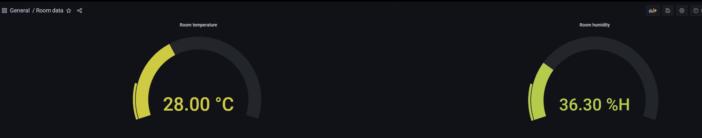

# Room temperature/humidity data to Influxdb using Raspberry PIs

Did this as a fun project in a couple of hours. DHT11 sensor attached to a Pi Pico W pushing data to a InfluxDB + Grafana on a Pi 4B. 

## Challenges
### Interfacing the DHT11 sensor with the Pi Pico W
There are multiple posts on the internet with misleading pinouts for this sensor. The correct one is as follows: 

Pin 1 > Signal

Pin 2 > Vcc

Pin 3 > Gnd

The GPIO28 pin on the Pico W corresponds to Pin 34 on the board. This kind of mapping should be fairly obvious if you've worked with these boards before. I was not and it caught me off guard. Referring the official pinout definitely helped.

### Tiny onboard memory on the Pico W
Memory for files on the board is very small. Much smaller(~2MB) than I had anticipated. I was attempting to push InfluxDB module and requests module only to realize that there was no space. However, there are modules specifically for micropython. I ended up using the urequests module to push to my InfluxDB.

### RTC is not powered
Albeit the Pi Pico W comes with an RTC, it is not powered by anything. This means that it resets on every boot. Time is required for every temperature/humidity datapoint. Here, we overcome this by getting the time on every boot. 
